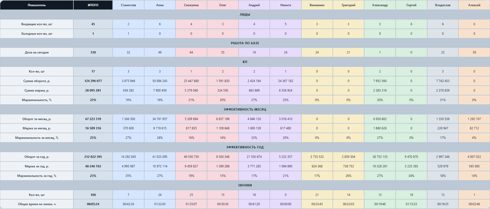
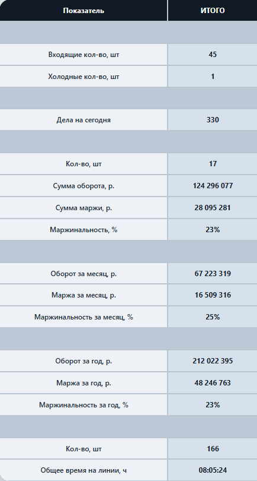
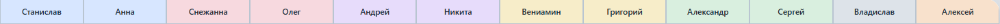

# CRM Dashboard — аналитика продаж и KPI

Внутренний dashboard для отдела продаж с интеграцией CRM и визуализацией статистики сотрудников.

## Что показывает проект

- интеграцию с Bitrix24 CRM;
- сбор данных по сделкам, лидам, делам и звонкам;
- расчёт оборота, маржи и маржинальности;
- группировку показателей по сотрудникам;
- автообновляемый управленческий дашборд;
- разделение демо-данных и рабочего источника данных.

## Для чего создавался проект

Проект разрабатывался как внутренняя система аналитики для отдела продаж.

Dashboard помогает:
- отслеживать эффективность сотрудников
- анализировать продажи
- контролировать KPI
- быстро получать статистику по менеджерам

## Используемые технологии

- HTML
- CSS
- JavaScript
- PHP
- API CRM

## Скриншоты

### Главный экран

### KPI и аналитика

### Таблица сотрудников

## Важно

В репозитории используется demo-версия проекта.

Все данные:
- обезличены
- изменены
- не относятся к реальным сотрудникам или компании
